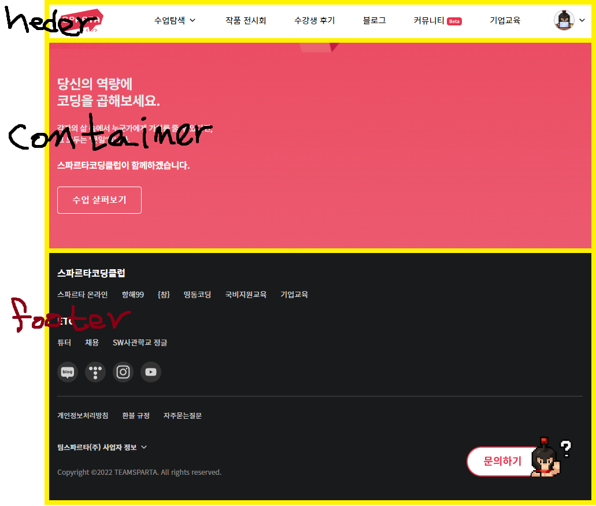

## Component
- 이전 강의에서 사용한 class형 컴포넌트는 이제 잘 사용하지 않는다.
    - 완전히 사라질 때까지 사용방법을 알고는 있는것이 바람직하다.

### Component
- 컴포넌트는 블록이다. 
<details>
<summary>예시 화면</summary>
<div markdown="1">
<br/></img><br/>
</div>
</details>

- 웹사이트를 조각내보면 이 블록을 더 잘 이해할 수 있다.
    - 위의 예시와 같이 간단하게 블록을 잘라볼 수 있다.
    <details>
    <summary>간단하게 HTML로 표현해보면</summary>
    <div markdown="1">
    
        ```html
        <!DOCTYPE html>
        <html lang="en">
        <head>
        </head>
        <body>
            <header> 
                ...
            </header>
            <div class="container">
                <div id="image-banner">
                    ...
                </div>
                <div id="contents-1">
                    ...
                </div>
            </div>
            <footer>
                ...
            </footer>
        </body>
        </html>
        ```

    </div>
    </details>

        - `<header/>`
        - `<container/>`
            - `<contents1/>`
        - `<footer/>`
>   - 이 웹사이트는 크게 `<header/>`, `<container/>`, `<footer/>` 세개의 컴포넌트가 있고, `<container/>` 컴포넌트는 자식 컴포넌트인 `<contents1/>` 컴포넌트로 이루어져 있다.

### State와 Props
- State는 Componenet가 가지고 있는 데이터이다.
    - `<header/>` 컴포넌트에서 사용할 데이터는 헤더 내부에 있다.
    - state는 이렇게 한 컴포넌트 내부에서 사용하는 정보를 생성, 수정하는 데이터이다.
- Props는 Component가 부모 Component로부터 받아온 데이터이다.
    - `<contents1/>`의 이미지 경로가 부모 컴포넌트인 `<container/>`에 있다고 가정한다면
        - `<contents1/>`컴포넌트는 부모 컴포넌트인  `<container/>`컴포넌트로부터 이미지 경로를 전달받아서 사용해야한다.
        - 부모 컴포넌트가 자식 컴포넌트 에게 전달해준 __이미지 경로__ , 곧 __데이터__ 가 자식 컴포넌트의 __props__ 가 된다.
    - 이때 부모 컴포넌트가 가지고 있는 데이터를 자식 컴포넌트가 추가하거나 수정할 수 없다.
    - __props__ 로 받은 데이터는 수정할 수 없다.