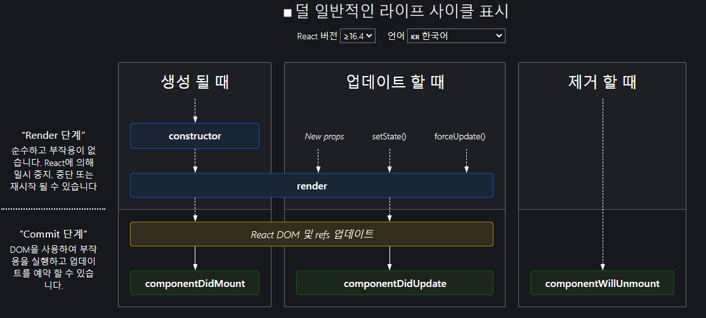

### 가상돔(Virtual DOM, Document Object Model)
- DOM트리 중 하나가 수정될 때마다 모든 객체를 검색하고 수정할 부분을 찾아 수정하는 것은 쓸데없는 연산이 많아지게한다.
- 가상돔은 메모리상에 존재하는 보이지 않는 돔이다.
- 기존 돔과 가상돔을 비교하여 바뀐 부분만 적용함
- 돔 업데이트 처리가 간결해지게 함
- 페이지에 처음 진입할 때와 데이터가 변했을 때 가상돔을 그리게 됨
- 사이트 구조에 따라 빠르기도 하지만 반대의 경우도 있기 때문에 항상 사용하지는 않는다.

### 라이프 사이클
- 컴포넌트의 라이프 사이클은 정말 중요한 개념
- 컴포넌트가 렌더링을 준비하는 순간부터, 페이지가 사라질 때까지를 라이프 사이클이라 부름

- 