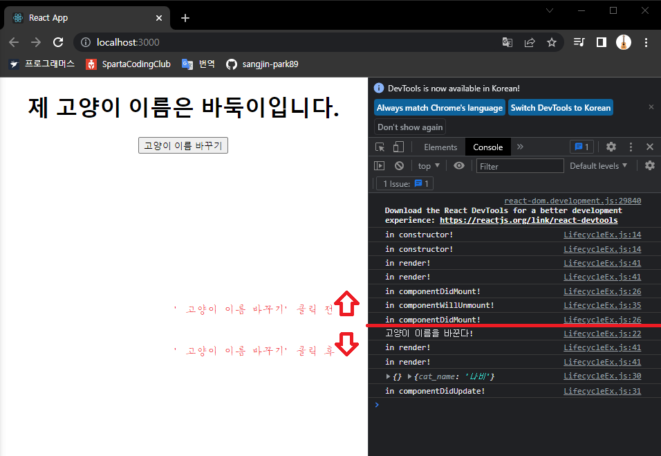

### 가상돔(Virtual DOM, Document Object Model)
- DOM트리 중 하나가 수정될 때마다 모든 객체를 검색하고 수정할 부분을 찾아 수정하는 것은 쓸데없는 연산이 많아지게한다.
- 가상돔은 메모리상에 존재하는 보이지 않는 돔이다.
- 기존 돔과 가상돔을 비교하여 바뀐 부분만 적용함
- 돔 업데이트 처리가 간결해지게 함
- 페이지에 처음 진입할 때와 데이터가 변했을 때 가상돔을 그리게 됨
- 사이트 구조에 따라 빠르기도 하지만 반대의 경우도 있기 때문에 항상 사용하지는 않는다.

### 라이프 사이클
- 컴포넌트의 라이프 사이클은 정말 중요한 개념
- 컴포넌트가 렌더링을 준비하는 순간부터, 페이지가 사라질 때까지를 라이프 사이클이라 부름

        출처 : https://projects.wojtekmaj.pl/react-lifecycle-methods-diagram/
- 컴포넌트 생성 -> 수정(업데이트) -> 제거
- 생성은 처음에 컴포넌트를 불러오는 단계
- 수정(업데이트)는 사용자의 행동(클릭, 데이터 입력 등)으로 데이터가 바뀌거나, 부모 컴포넌트가 렌더링 할 때 업데이트 됨
    - props가 바뀔 때
    - state가 바뀔 때
    - 부모 컴포넌트가 업데이트 되었을 때(=리렌더링했을 때)
    - 강제 업데이트 했을 때(forceUpdate()를 통해 강제로 컴포넌트를 업데이트 할 때)
- 제거는 페이지 이동, 사용자의 행동으로 컴포넌트가 화면에서 사라지는 단계

### 라이프 사이클 함수
- [LifecycleEx](../lifecycle/src/LifecycleEx.js)를 바탕으로 설명

> - constructor() : 생성자 함수. 컴포넌트가 생성되면 가장 먼저 호출된다.
    ```jsx
    constructor(props) {
        super(props);
        this.state = {
        cat_name: '나비',
        };
        console.log('in constructor!');
    }
    ```

```jsx
render() {
    console.log('in render!');
    return (
      <div>
          {/* render 안에서 컴포넌트의 데이터 state를 참조할 수 있습니다. */}
        <h1>제 고양이 이름은 {this.state.cat_name}입니다.</h1>
        <button onClick={this.changeCatName}>고양이 이름 바꾸기</button>
      </div>
    );
}
```
- render() : 컴포넌트의 모양을 정의하는 함수. state, props에 접근하여 데이터를 보여줄 수 있다.
    - 컴포넌트의 모양에만 관여하는 것이 가장 좋다.
    - state나 props에 접근할 수 있다고 해서 이를 수정하려고 하면 안됨.
```jsx
componentDidMount(){
    console.log('in componentDidMount!');
}
```
- componentDidMount() : 첫번째 렌더링 후에 단 한번 실행된다. 리렌더링(수정,업데이트) 시에는 실행되지 않는다.
    - DidMount, 마운트가 완료되었다는 말
    - 보통은 ajax 요청, 이벤트 등록, 함수 호출 등의 작업을 처리한다.
    - 이미 가상돔이 실제돔에 올라간 후이기 때문에 DOM관련 처리가 가능하다.
```jsx
componentDidUpdate(prevProps, prevState){
    console.log(prevProps, prevState);
    console.log('in componentDidUpdate!');
}
```
- componentDidUpdate(prevProps, prevState, snapshot) : 리렌더링(수정,업데이트)을 완료한 후 실행되는 함수
    - prevProps,prevState 두개의 파라미터가 중요하다. 
        - 각각 업데이트 되기 전 props, state이다. 
        - 이전 데이터와 비교하기에 용이하다.
    - DidUpdate()는 가상돔이 실제돔에 올라간 후이기 때문에 DOM관련 처리가 가능하다.
```jsx
componentWillUnmount(){
    console.log('in componentWillUnmount!');
}
```
- componentWillUnmount() : 컴포넌트가 제거된 후에 실행되는 함수.
    - 삼항연산자로 컴포넌트를 보여주거나 없애는 것을 __조건부 렌더링__ 이라고 부른다.